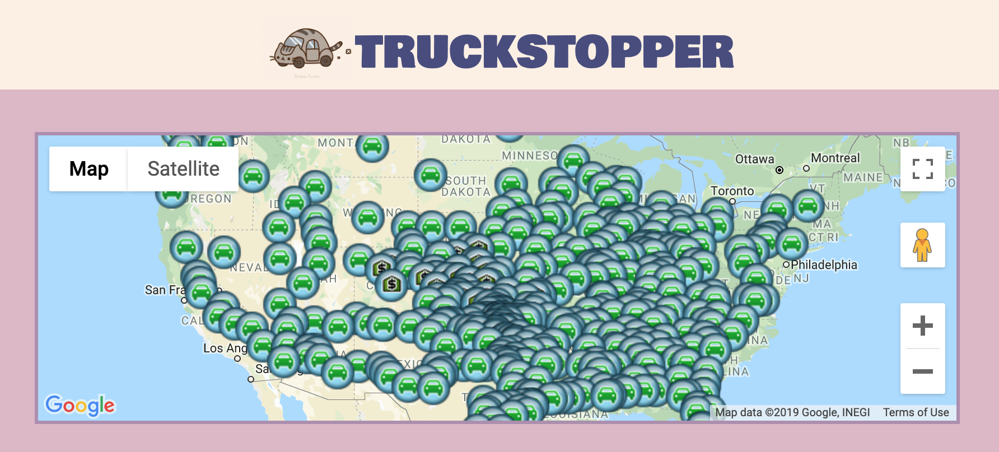
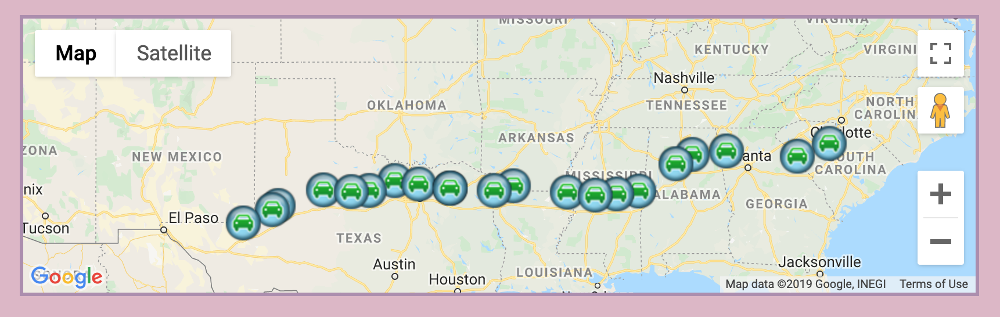
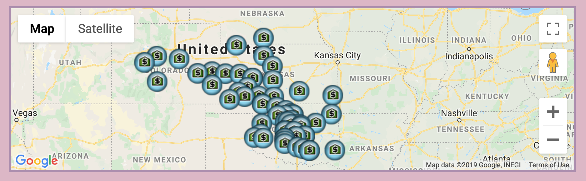
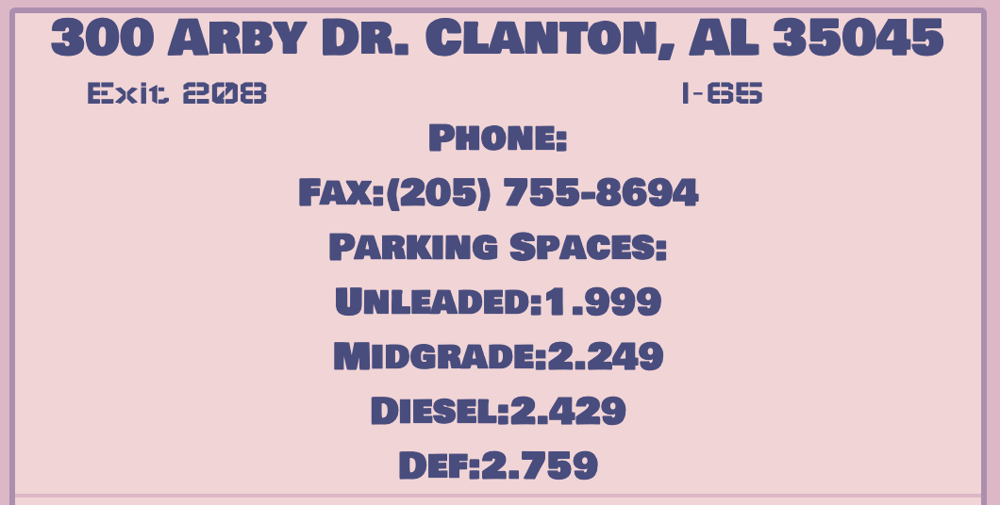

## Table of Contents

1. [Introduction](#introduction)
2. [Setup: Getting Started](#setup-getting-started)
3. [Navigating the App](#navigating-the-app)
4. [Technology Used](#technology-used)
5. [Contributors](#contributors)

## Introduction

This is a full-stack, single page application that allows users to search for FlyingK truck stops.
It is also [available on Heroku](https://mini-cc-project.herokuapp.com/).

## Setup

You will need to have PostgreSQL installed.
To get started, clone this repository, navigate to the directory, and run the following commands in your terminal:

Install dependencies:

```
yarn
```

Create the build directory:

```
yarn build
```

Start the server:

```
yarn start
```

Then go to **localhost:9000** to see the app.

## Navigating the App

When the user first opens the app, it will display all FlyingK truck stops around the country.


These truck stops can be filtered by location (state, city, and highway), truck services available, and type of stop.


_Filtered by highway "I-20"_


_Filtered to display only country stores_

Once a search has been executed, detailed information about every stop matching the search criteria will be provided.


Users can also click a stop's marker on the map to display its details.

## Technology Used

- Axios
- Enzyme
- Heroku
- Knex
- PostgreSQL
- React
- React-Redux

## Contributors

- [@baruishi](https://github.com/baruishi)
- [@followdiallo](https://github.com/followdiallo)
- [@forbesd7](https://github.com/forbesd7)
- [@miniengineer](https://github.com/miniengineer) (Tech Lead)
